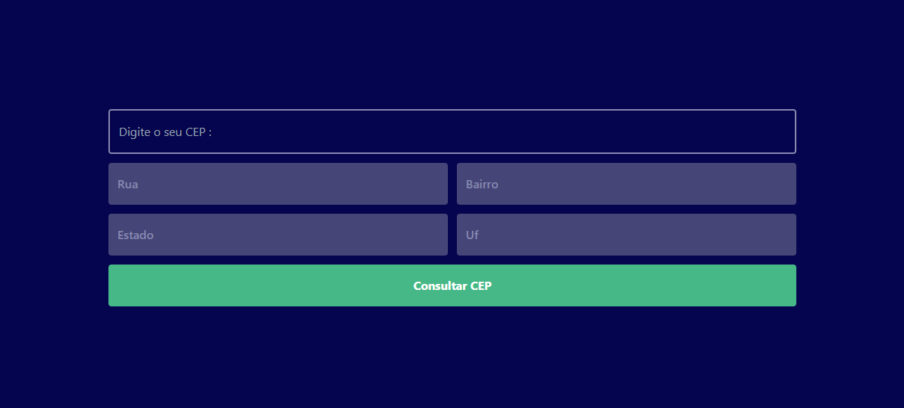

# API-VIACEP

The idea of ​​the project was to create a zip code locator. To practice using api in javascript and tailwind css;

## 🚀 Technologies :

**Front-end:** HTML5, TAILWIND CSS and JAVASCRIPT;

## 👩‍💻 Functionalities:

- Get information about the zip code you want;

## 👨 Author :

[@jhonathanSousa](https://www.linkedin.com/in/jhonathan-alves-sousa/)